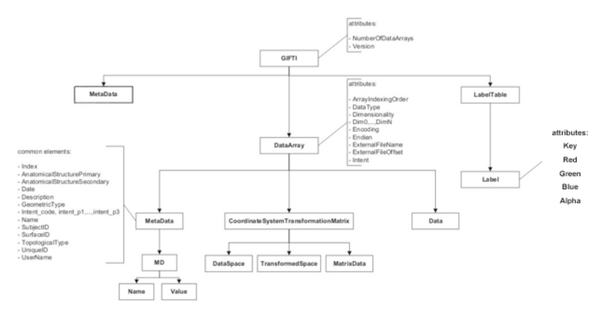
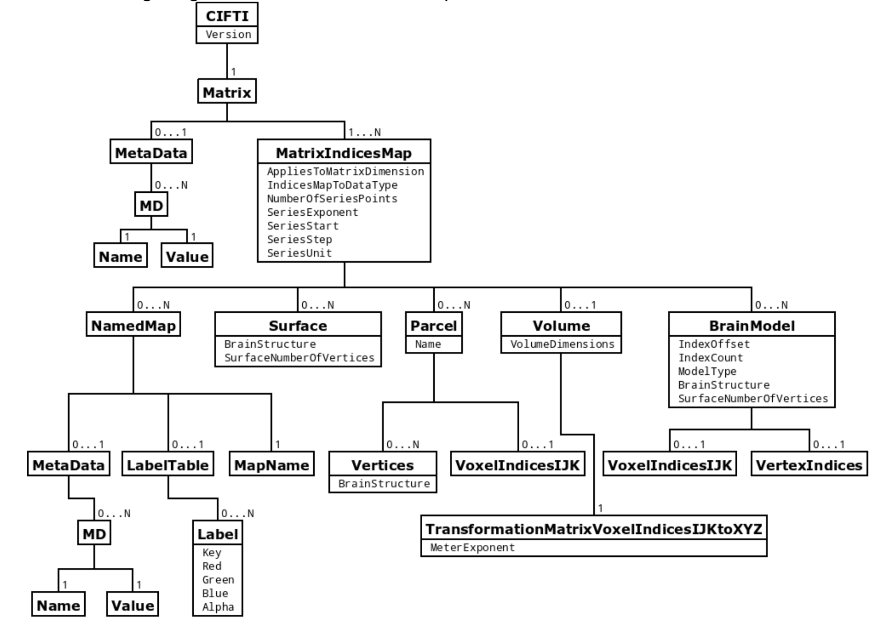

```
%matplotlib nbagg
import numpy as np
import nibabel as nib
import matplotlib.pyplot as plt
```
# Nibabel: loading MRI volumes
## Image file formats beyond NIFTI
Nibabel can also read:
- ANALYZE (plain, SPM99, SPM2 and later)
- Freesurfer MGH/MGZ format
- MINC1 and MINC2
- limited support for [Dicom](http://nipy.org/nibabel/dicom/dicom.html#dicom)
- Philips PAR/REC

You can get the data and affine for all these formats using:
> ```
> img = nib.load(<filename>)
> affine = img.affine
> data = img.get_data() # repeated calls of get_data() will return a cached version
> ```
Other metadata is available through `img.header`, but will be format-specific.

## Acessing part of the data
Running `nibabel.load` will only read in the header, not the full data.
You can exploit this using the `[dataobj](http://nipy.org/nibabel/nibabel_images.html#array-proxies-and-proxy-images)` object:
```
img = nib.load('100307/T1w.nii.gz')
zslice = img.dataobj[:, :, 50]  # only loads the slice with k=50
plt.imshow(slice.T, cmap='gray')
```

## Surfaces in nibabel
Nibabel supports surfaces in both [Freesurfer](http://nipy.org/nibabel/reference/nibabel.freesurfer.html#module-nibabel.freesurfer)
and [GIFTI](http://nipy.org/nibabel/reference/nibabel.gifti.html#module-nibabel.gifti) formats



```
img = nib.load('100307/fsaverage_LR32k/100307.L.white.32k_fs_LR.surf.gii')
vertices, faces = [darray.data for darray in img.darrays]
vertices, faces
```

```
from nibabel import freesurfer
freesurfer.io.write_geometry('lh.white', vertices, faces)
```

```
thickness = nib.load('100307/fsaverage_LR32k/100307.L.thickness.32k_fs_LR.shape.gii').darrays[0].data
thickness
```

## [Tractography streamlines](http://nipy.org/nibabel/reference/nibabel.streamlines.html#module-nibabel.streamlines) in nibabel
# [CIFTI](https://github.com/MichielCottaar/cifti): easy creation/manipulation
This module allows for straight-forward creation of CIFTI files and the reading and manipulating of existing ones

The CIFTI format is used in brain imaging to store data acquired across the brain volume (in voxels) and/or
the brain surface (in vertices). The format is unique in that it can store data from both volume and
surface as opposed to NIftI, which only covers the brain volume, and GIftI, which only covers the brain surface.
See http://www.nitrc.org/projects/cifti for specification of the CIFTI format.

Each type of CIFTI axes describing the rows/columns in a CIFTI matrix is given a unique class:
- `BrainModel`: each row/column is a voxel or vertex
- `Parcels`: each row/column is a group of voxels and/or vertices
- `Series`: each row/column is a timepoint, which increases monotonically
- `Scalar`: each row/column has a unique name (with optional meta-data)
- `Label`: each row/column has a unique name and label table (with optional meta-data)
All of these classes are derived from `Axis`

Reading a CIFTI file (through `read`) will return a matrix and a pair of axes describing the rows and columns of the matrix.
Similarly to write a CIFTI file (through `write`) requires a matrix and a pair of axes.

CIFTI axes of the same type can be concatenated by adding them together.
Numpy indexing also works on them (except for Series objects, which have to remain monotonically increasing or decreasing)

## Installation

This package can be installed directly from github using:
```
!pip install git+https://github.com/MichielCottaar/cifti.git
```


## Examples
```
import cifti
ctx = thickness != 0
arr = np.random.rand(ctx.sum())

bm_ctx = cifti.BrainModel.from_mask(ctx, name='CortexLeft')
sc = cifti.Scalar.from_names(['random'])
cifti.write('random_ctx.dscalar.nii', arr[None, :], (sc, bm_ctx))
```

```
!wb_view 100307/fsaverage_LR32k/100307.*.32k_fs_LR.surf.gii random_ctx.dscalar.nii
```

```
img = nib.load('100307/aparc+aseg.nii.gz')
cerebellum = img.get_data() == 8

bm_cerebellum = cifti.BrainModel.from_mask(cerebellum, name='CerebellumLeft', affine=img.affine)
bm = bm_ctx + bm_cerebellum
sc = cifti.Scalar.from_names(['random1', 'random2'])
arr = np.random.rand(2, len(bm))
cifti.write('random_ctx_cerebellum.dscalar.nii', arr, (sc, bm))
```

```
!wb_view 100307/fsaverage_LR32k/100307.*.32k_fs_LR.surf.gii 100307/T1w.nii.gz random_ctx_cerebellum.dscalar.nii
```

```
arr = abs(thickness[ctx, None] - thickness[None, ctx])
cifti.write('diff_thickness.dconn.nii', arr, (bm_ctx, bm_ctx))
```

```
!wb_view 100307/fsaverage_LR32k/100307.*.32k_fs_LR.surf.gii diff_thickness.dconn.nii
```

Let's finally create a parcellated label file:
```
parcels = cifti.Parcels.from_brain_models([('thin', bm_ctx[thickness[ctx] < 2]),
                                           ('cerbellum', bm_cerebellum),
                                           ('thick', bm_ctx[thickness[ctx] > 3]),
                                          ])
scl = cifti.Scalar.from_names(['rgb'])
label = scl.to_label([{1: ('red', (1, 0, 0, 1)),
                       2: ('green', (0, 1, 0, 1)),
                       3: ('blue', (0, 0, 1, 1))}])
arr = np.array([[1, 2, 3]])
cifti.write('labels.plabel.nii', arr, (label, parcels))
```

```
!wb_view 100307/fsaverage_LR32k/100307.*.32k_fs_LR.surf.gii 100307/T1w.nii.gz labels.plabel.nii
```

